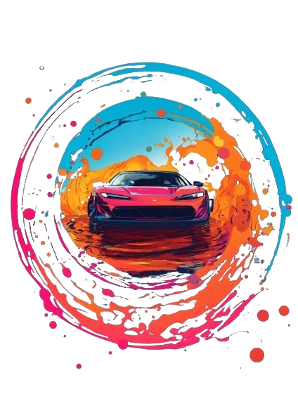

    Preview do podcast

    <audio src="./output/podcast_capcut.mpeg" controls title="Podcast editado"></audio>

# Projeto Podcast Gerado por I.A.s

Projeto com o objetivo de gerar um podcast utilizando ferramentas de IA através de prompts mais trabalhado.

Utilizer uma esteira de prompts para gerar cada etapa do processo criativo.

## 💻 Tecnologias utilizadas no projeto

- [ChatGPT](https://chat.openai.com/) 
- [Lexica](https://lexica.art/)
- [Remove bg](https://www.remove.bg/)
- [ElevenLabs](https://beta.elevenlabs.io/)
- [Capcut](https://www.capcut.com/pt-br/)

## ✨ Como foi feito ?

- Roteiro gerado via chatgpt
- Audio gerado pela elevenLabs
- Lexica e Remove bg para gerar capa
- Capcut para tratar aúdio e adicionar sons de fundo
- Não foi utilizado Midjourney, pois teria que pagar assinatura.

## 📄 Prompts e ferramentas

ChatGPT：

Título: De Volta para o Front End
Subtítulo: Desvendando a Acessibilidade na Web

- prompt do Título: 

Você é um roteirista de podcast, e vamos criar um podcast de tecnologia, focado em front end e acessibilidade na web. Gostaria de uma ajuda sua para criar 10 sugestões de nomes criativos para um podcast de front end feito por nerds,e que tenha algum trocadilho nerd no nome. O podcast vai falar sobre dicas e novidades sobre o mundo do front end,acessibilidade na web e o que está acontecendo no mercado.

    {REGRAS}

    - O nome deve ser enxuto, um nome e um subtítulo
    - O nome tenha algum trocadilho nerd com nomes de franquias conhecidas como The Big Bang Theory, Harry Potter, Universo DC, Star Wars , O Senhor dos Anéis ou De Volta Para o Futuro
    - O nome deve conter alguma palavra forte que remeta a front end e acessibilidade na web

    {REGRAS NEGATIVAS}

    - Não quero que o título contenha palavras em inglês
    - Não utilize a palavra frontend no nome nem qualquer variação dela

- prompt do Roteiro: 

Você é um roteirista de podcast, e vamos criar um  roteiro de um podcast de tecnologia, focado em frontend e acessibilidade na web cujo o nome é "De Volta para o Front End - Desvendando a Acessibilidade na Web" e tem foco em frontend e acessibilidade na web,  com o público alvo de iniciantes em frontend, o formato do roteiro deve ser

    [INTRODUÇÃO]
    [CURIOSIDADE 1]
    [CURIOSIDADE 2]
    [FINALIZAÇÃO]

    {REGRAS}

    - no bloco [INTRODUÇÃO] substitua por uma introdução iguais as introduções dos vídeos do canal 'Rockeseat', como se fossem escritos pelo Diego Fernandes
    - no bloco [CURIOSIDADE 1] substitua por uma curiosidade de CSS
    - no bloco [CURIOSIDADE 2] substitua por uma curiosidade de HTML
    - no bloco [FINALIZAÇÃO] substitua por uma despedida cool com o final 'Eu sou a Paty e esse foi o De Volta para o Front End dessa semana'
    - use termos de fácil explicação
    - O podcast vai ser apresentado somente por uma pessoa, chamada Paty
    - O podcast deve ser curto

    {REGRAS NEGATIVAS}

    - Não use muitos termos técnicos
    - Não ultrapasse 5 minutos de duração

Lexica.art：

- No léxica utilizamos o acervo público de imagens geradas por outras pessoas, os termos de pesquisa que utilizei foram:

- prompt: circle.splash,logo,carting

## 📚 Materiais

- Imagens utilizadas em `assets`
- Áudios e vídeo utilizadas em `output`

